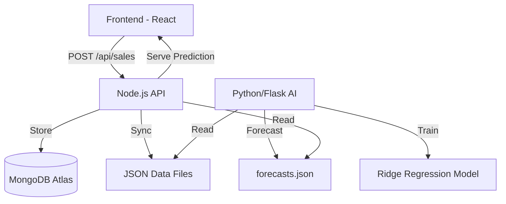

# STOCKSENSE: INTELLIGENT INVENTORY MANAGEMENT SYSTEM
## A Technical Thesis Report

**Author:** [User Name]  
**Date:** March 2026  
**Subject:** Advanced Software Engineering & Artificial Intelligence  

---

## ABSTRACT

StockSense is a state-of-the-art inventory management system designed to solve the critical challenges of modern supply chain management: overstocking, stockouts, and demand uncertainty. By integrating a React-based frontend with a dual-backend architecture (Node.js/Express and Python/Flask), the system provides real-time tracking, secure user authentication with multi-factor OTP support, and powerful predictive analytics. The core innovation lies in its demand forecasting engine, which utilizes Ridge Regression and cyclical temporal feature engineering to provide highly accurate 30, 60, and 90-day predictions.

---

## 1. INTRODUCTION

### 1.1 Overview
Efficient inventory management is the backbone of any product-based business. Conventional systems often rely on static reorder points, which fail to account for seasonal variations, market trends, or sudden demand spikes caused by festivals and events.

### 1.2 Objectives
The primary objective of this project was to build a system that:
- Automates stock tracking and sales recording.
- Provides a secure, role-based access control system.
- Leverages Machine Learning (ML) to forecast future demand based on historical patterns and external factors (e.g., holidays).
- Offers a premium, responsive UI for business managers to make data-driven decisions.

---

## 2. SYSTEM ARCHITECTURE

StockSense employs a decoupled, multi-layered architecture to ensure scalability, security, and performance.

### 2.1 Component Breakdown
1.  **Frontend (UI/UX)**: Built with **React 19** and **Vite**, using **TypeScript** for type-safe development. It provides a dynamic dashboard, real-time notifications, and high-fidelity analytics visualizations via **Recharts**.
2.  **API Gateway (Production Backend)**: A **Node.js/Express** server that handles transaction logic, user sessions, and database interactions with **MongoDB Atlas**.
3.  **AI Services (ML Backend)**: A **Python/Flask** microservice dedicated to heavy-duty data processing, synthetic data generation, and training predictive models.
4.  **Database Layer**: **MongoDB Atlas** serves as the primary persistent store for production data, while lightweight **JSON files** are used for initial seeding and AI model exports.

### 2.2 Data Flow Diagram

---

## 3. SECURITY & AUTHENTICATION

The system implements a robust authentication flow to protect sensitive business data.

### 3.1 Multi-Factor Authentication (OTP)
Instead of relying solely on passwords, StockSense uses a dynamic OTP (One-Time Password) system for both registration and login.
- **Workflow**: The user enters their email $\rightarrow$ System generates a 6-digit code $\rightarrow$ Code is sent via **Nodemailer** using SMTP $\rightarrow$ User verifies the code to gain access.
- **Security**: OTPs are server-side hashed and expire after 5 minutes.

### 3.2 Session Management
Sessions are managed using `express-session` and persisted in MongoDB via `connect-mongo`. This ensures that user sessions remain valid even if the API server restarts.

---

## 4. AI DEMAND FORECASTING ENGINE

The core intelligence of StockSense is its predictive engine, which transitions from reactive inventory tracking to proactive planning.

### 4.1 Machine Learning Model
The system utilizes **Ridge Regression**, a linear regression variant that includes L2 regularization. This choice provides a balance between computational efficiency (suitable for microservices) and the ability to handle multi-collinearity in features.

### 4.2 Feature Engineering
A significant portion of the system's accuracy comes from its sophisticated feature extraction:
- **Cyclical Temporal Features**: Time-based data (day of week, month) is transformed using Sine and Cosine functions to capture its periodic nature.
- **Festival Awareness**: The model calculates proximity to major events (e.g., Diwali, Christmas). A proximity score is generated using an exponential decay function: $S = e^{-d/3}$, where $d$ is the number of days to the event.
- **Lag Features**: Historical sales data from 1, 7, 14, and 30 days ago are used as predictors.
- **Rolling Windows**: Moving averages help the model identify short-term and long-term trends.

### 4.3 Forecasting Output
The model generates three horizons:
- **30-Day Forecast**: Immediate inventory needs and restocking alerts.
- **60-Day & 90-Day Forecasts**: Long-term procurement planning.

---

## 5. FRONTEND IMPLEMENTATION

### 5.1 Technology Stack
- **Framework**: React 19 (Functional Components & Hooks)
- **State Management**: React Context API for global state (Auth, Theme).
- **Styling**: Modern CSS with glassmorphism and dark mode support.
- **Visualizations**: **Recharts** for interactive line graphs, bar charts, and scatter plots.

### 5.2 Key Features
- **Intelligent Dashboard**: Displays KPIs like Total Sales, Revenue, and Low Stock Alerts.
- **Inventory Matrix**: A sortable, searchable grid for product management.
- **Analytical Insights**: Graphs showing historical vs. predicted demand.

---

## 6. BACKEND & DATABASE

### 6.1 Dual-Backend Logic
- **Node.js**: Serves as the primary API for the frontend, managing users, sales, and products.
- **Python**: Acts as a data science engine, running heavy ML training scripts and exporting results to JSON for fast access by the Node server.

### 6.2 Data Persistence
The system uses **MongoDB Atlas** for its flexible document schema, allowing products to store complex metadata and historical logs without rigid migrations.

---

## 7. CONCLUSION & FUTURE SCOPE

StockSense successfully demonstrates the integration of modern web technologies with predictive machine learning. By providing actionable insights instead of just raw data, the system empowers small and medium-sized enterprises to optimize their supply chains.

### 7.1 Future Enhancements
- Integration with external API providers for real-time weather data.
- Implementation of a chatbot interface for natural language inventory queries.
- Automated supplier communication for autonomous restocking.

---

## 8. INSTRUCTIONS FOR PDF CONVERSION (FOR THESIS)

To convert this documentation into a professional PDF for your thesis:

1.  **VS Code (Recommended)**:
    - Install the **"Markdown PDF"** extension (by yyzhang).
    - Open this file (`STOCKSENSE_THESIS_DOCUMENTATION.md`).
    - Press `Ctrl+Shift+P` and type `Markdown PDF: Export (pdf)`.
2.  **Browser**:
    - Open the file in a Markdown viewer or GitHub.
    - Right-click $\rightarrow$ **Print** $\rightarrow$ **Save as PDF**.
3.  **MS Word / Google Docs**:
    - Copy the contents and paste them into a document editor. The formatting will be preserved.
    - Use "Insert Page Break" before each major section for a cleaner layout.
